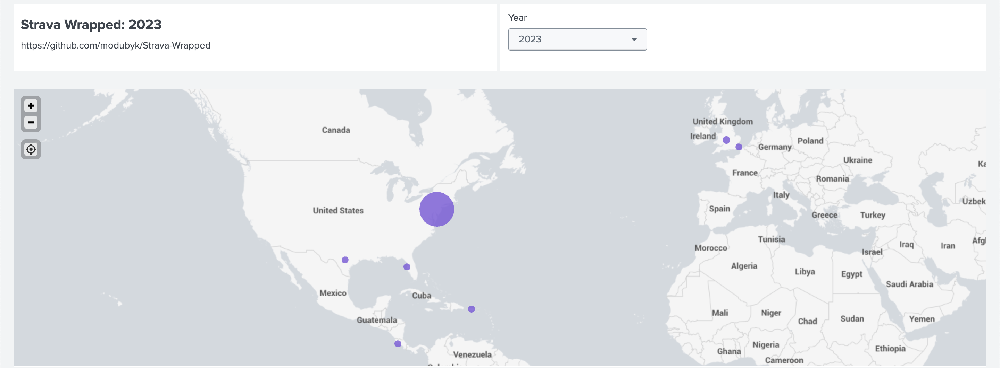
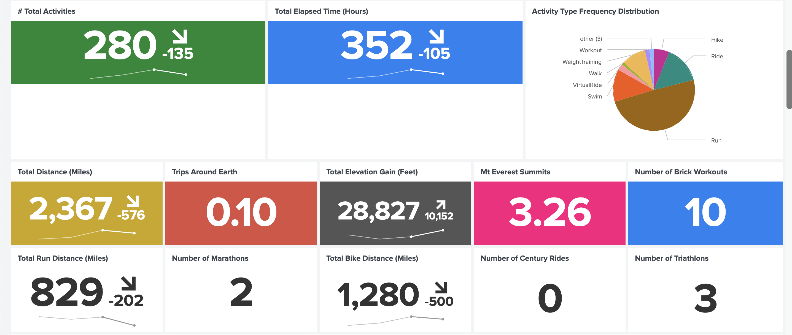
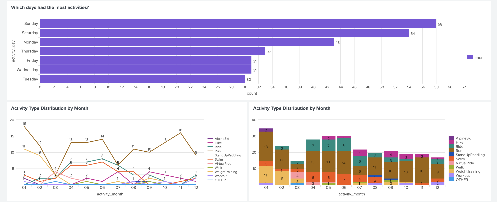
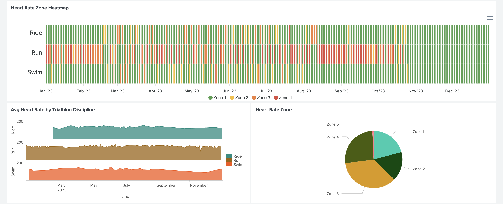
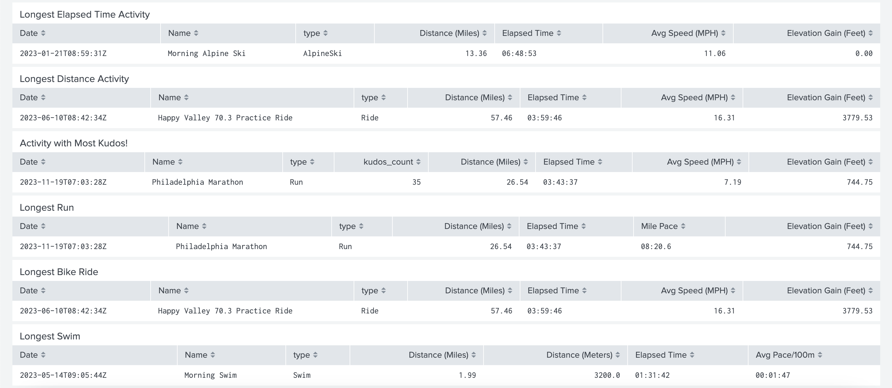
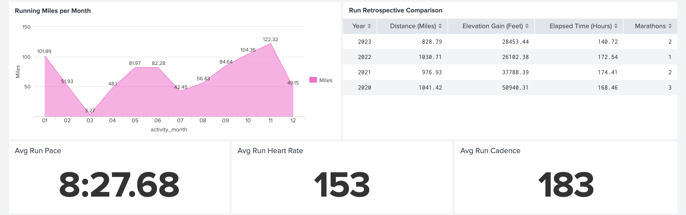
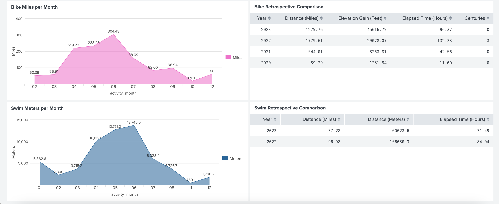

# Strava Wrapped

This project leverages a collection of Python Scripts and other resources to generate a year-end analytic product based on an athlete's Strava exercise data. The inspiration for this project was based on Spotify Wrapped. Just as Spotify Wrapped provides users a year-end personalized summary of their music listening habits and preferences, this project generates a customized report based on individual athlete exercise data.

## Resources

- `config.yml` -- Configuration file defining Strava API App details, secrets, output file paths, and other parameters<br>
- `strava_auth.py` -- Handles authentication including authorizing Strava API Application to access user exercise data and obtains OAuth Bearer token. A pre-requisite is creating a Strava API application at https://developers.strava.com/ and placing client_id and client_secret in `config.yml`<br>
- `strava_collection.py` -- Performs data collection from user's profile. Exercise data is stored in a serialized python pickle and csv<br>
- `strava_wrapped_summary.py` -- Generate Strava Wrapped summary statistics in JSON based on exercise data collected from `strava_collection.py`<br>
- `strava_wrapped.spl` -- Splunk dashboard leverages CSVs generated by `strava_collection.py` as lookup tables<br>

## Splunk Dashboard Report









## Summary Analysis from `strava_wrapped_summary.py`
```
{
    "2020": {
        "num_events": 192,
        "total_elapsed_time": {
            "seconds": 822983,
            "minutes": 13716.38,
            "hours": 228.61
        },
        "longest_elapsed_time": {
            "seconds": 21740,
            "minutes": 362.33,
            "hours": 6.04,
            "activity": "\"{\\\"resource_state\\\":2,\\\"athlete\\\":{\\\"id\\\":38198630,\\\"resource_state\\\":1},\\\"name\\\":\\\"South Arapahoe Peak Hike\\\",\\\"distance\\\":18948.2,\\\"moving_time\\\":17565,\\\"elapsed_time\\\":21740,\\\"total_elevation_gain\\\":1205.3,\\\"type\\\":\\\"Walk\\\",\\\"sport_type\\\":\\\"Walk\\\",\\\"workout_type\\\":null,\\\"id\\\":4117054333,\\\"start_date\\\":\\\"2020-09-26T13:02:06Z\\\",\\\"start_date_local\\\":1601103726000,\\\"timezone\\\":\\\"(GMT-07:00) America\\\\/Denver\\\",\\\"utc_offset\\\":-21600.0,\\\"location_city\\\":null,\\\"location_state\\\":null,\\\"location_country\\\":null,\\\"achievement_count\\\":0,\\\"kudos_count\\\":0,\\\"comment_count\\\":0,\\\"athlete_count\\\":1,\\\"photo_count\\\":0,\\\"trainer\\\":false,\\\"commute\\\":false,\\\"manual\\\":false,\\\"private\\\":false,\\\"visibility\\\":\\\"followers_only\\\",\\\"flagged\\\":false,\\\"gear_id\\\":null,\\\"start_latlng\\\":[39.994595,-105.634173],\\\"end_latlng\\\":[39.990169,-105.628916],\\\"average_speed\\\":1.079,\\\"max_speed\\\":4.4,\\\"average_cadence\\\":53.1,\\\"has_heartrate\\\":true,\\\"average_heartrate\\\":100.9,\\\"max_heartrate\\\":142.0,\\\"heartrate_opt_out\\\":false,\\\"display_hide_heartrate_option\\\":true,\\\"elev_high\\\":4037.3,\\\"elev_low\\\":3062.6,\\\"upload_id\\\":4405344913,\\\"upload_id_str\\\":\\\"4405344913\\\",\\\"external_id\\\":\\\"garmin_push_5596254434\\\",\\\"from_accepted_tag\\\":false,\\\"pr_count\\\":0,\\\"total_photo_count\\\":3,\\\"has_kudoed\\\":false,\\\"average_watts\\\":null,\\\"kilojoules\\\":null,\\\"device_watts\\\":null,\\\"average_temp\\\":null,\\\"max_watts\\\":null,\\\"weighted_average_watts\\\":null,\\\"start_date_local_day_of_week\\\":5}\""
        },
        "avg_elapsed_time": {
            "seconds": 4286,
            "minutes": 71.43,
            "hours": 1.19
        },
        "total_distance": {
            "meters": 1947012,
            "miles": 1209.82,
            "kilometers": 1947.01,
            "trips_around_the_world": 0.05
        },
        "max_distance": {
            "meters": 42320,
            "miles": 26.3,
            "kilometers": 42.32,
            "activity": 0
        },
        "avg_distance": {
            "meters": 10140,
            "miles": 6.3,
            "kilometers": 10.14
        },
        "total_elevation_gain": {
            "meters": 21582,
            "feet": 70807.09,
            "miles": 13.41,
            "trips_to_mt_everest_summit": 2.44
        },
        "sport_type_distribution": {
            "Run": 155,
            "Walk": 15,
            "Ride": 11,
            "Workout": 6,
            "WeightTraining": 4,
            "Elliptical": 1
        },
        "activity_day_freq_distribution": {
            "int": {
                "5": 43,
                "6": 31,
                "1": 27,
                "0": 23,
                "4": 23,
                "3": 23,
                "2": 22
            },
            "days": {
                "Monday": 23,
                "Tuesday": 27,
                "Wednesday": 22,
                "Thursday": 23,
                "Friday": 23,
                "Saturday": 43,
                "Sunday": 31
            }
        }
    },
    "2021": {
        "num_events": 268,
        "total_elapsed_time": {
            "seconds": 1060839,
            "minutes": 17680.65,
            "hours": 294.68
        },
        "longest_elapsed_time": {
            "seconds": 23361,
            "minutes": 389.35,
            "hours": 6.49,
            "activity": "\"{\\\"resource_state\\\":2,\\\"athlete\\\":{\\\"id\\\":38198630,\\\"resource_state\\\":1},\\\"name\\\":\\\"Morning Hike\\\",\\\"distance\\\":19079.3,\\\"moving_time\\\":19157,\\\"elapsed_time\\\":23361,\\\"total_elevation_gain\\\":1151.1,\\\"type\\\":\\\"Run\\\",\\\"sport_type\\\":\\\"Run\\\",\\\"workout_type\\\":0.0,\\\"id\\\":5980299511,\\\"start_date\\\":\\\"2021-09-17T12:21:05Z\\\",\\\"start_date_local\\\":1631866865000,\\\"timezone\\\":\\\"(GMT-05:00) America\\\\/New_York\\\",\\\"utc_offset\\\":-14400.0,\\\"location_city\\\":null,\\\"location_state\\\":null,\\\"location_country\\\":null,\\\"achievement_count\\\":0,\\\"kudos_count\\\":2,\\\"comment_count\\\":0,\\\"athlete_count\\\":1,\\\"photo_count\\\":0,\\\"trainer\\\":false,\\\"commute\\\":false,\\\"manual\\\":false,\\\"private\\\":false,\\\"visibility\\\":\\\"followers_only\\\",\\\"flagged\\\":false,\\\"gear_id\\\":null,\\\"start_latlng\\\":[44.149405,-73.767968],\\\"end_latlng\\\":[44.149636,-73.76757],\\\"average_speed\\\":0.996,\\\"max_speed\\\":3.6,\\\"average_cadence\\\":56.7,\\\"has_heartrate\\\":true,\\\"average_heartrate\\\":113.0,\\\"max_heartrate\\\":164.0,\\\"heartrate_opt_out\\\":false,\\\"display_hide_heartrate_option\\\":true,\\\"elev_high\\\":1433.7,\\\"elev_low\\\":386.0,\\\"upload_id\\\":6356631474,\\\"upload_id_str\\\":\\\"6356631474\\\",\\\"external_id\\\":\\\"garmin_push_7511247779\\\",\\\"from_accepted_tag\\\":false,\\\"pr_count\\\":0,\\\"total_photo_count\\\":0,\\\"has_kudoed\\\":false,\\\"average_watts\\\":null,\\\"kilojoules\\\":null,\\\"device_watts\\\":null,\\\"average_temp\\\":null,\\\"max_watts\\\":null,\\\"weighted_average_watts\\\":null,\\\"start_date_local_day_of_week\\\":4}\""
        },
        "avg_elapsed_time": {
            "seconds": 3958,
            "minutes": 65.97,
            "hours": 1.1
        },
        "total_distance": {
            "meters": 2491899,
            "miles": 1548.39,
            "kilometers": 2491.9,
            "trips_around_the_world": 0.06
        },
        "max_distance": {
            "meters": 83769,
            "miles": 52.05,
            "kilometers": 83.77,
            "activity": 0
        },
        "avg_distance": {
            "meters": 9298,
            "miles": 5.78,
            "kilometers": 9.3
        },
        "total_elevation_gain": {
            "meters": 14887,
            "feet": 48841.86,
            "miles": 9.25,
            "trips_to_mt_everest_summit": 1.68
        },
        "sport_type_distribution": {
            "Run": 149,
            "WeightTraining": 75,
            "Ride": 25,
            "Elliptical": 12,
            "Walk": 3,
            "Hike": 2,
            "Workout": 1,
            "InlineSkate": 1
        },
        "activity_day_freq_distribution": {
            "int": {
                "1": 47,
                "5": 43,
                "6": 39,
                "4": 38,
                "0": 37,
                "2": 37,
                "3": 27
            },
            "days": {
                "Monday": 37,
                "Tuesday": 47,
                "Wednesday": 37,
                "Thursday": 27,
                "Friday": 38,
                "Saturday": 43,
                "Sunday": 39
            }
        }
    },
    "2022": {
        "num_events": 415,
        "total_elapsed_time": {
            "seconds": 1642815,
            "minutes": 27380.25,
            "hours": 456.34
        },
        "longest_elapsed_time": {
            "seconds": 35513,
            "minutes": 591.88,
            "hours": 9.86,
            "activity": "\"{\\\"resource_state\\\":2,\\\"athlete\\\":{\\\"id\\\":38198630,\\\"resource_state\\\":1},\\\"name\\\":\\\"Hike in & Marcy\\\",\\\"distance\\\":23392.4,\\\"moving_time\\\":25381,\\\"elapsed_time\\\":35513,\\\"total_elevation_gain\\\":1108.0,\\\"type\\\":\\\"Hike\\\",\\\"sport_type\\\":\\\"Hike\\\",\\\"workout_type\\\":null,\\\"id\\\":7905548336,\\\"start_date\\\":\\\"2022-09-30T14:09:38Z\\\",\\\"start_date_local\\\":1664532578000,\\\"timezone\\\":\\\"(GMT-05:00) America\\\\/New_York\\\",\\\"utc_offset\\\":-14400.0,\\\"location_city\\\":null,\\\"location_state\\\":null,\\\"location_country\\\":null,\\\"achievement_count\\\":0,\\\"kudos_count\\\":16,\\\"comment_count\\\":2,\\\"athlete_count\\\":1,\\\"photo_count\\\":0,\\\"trainer\\\":false,\\\"commute\\\":false,\\\"manual\\\":false,\\\"private\\\":false,\\\"visibility\\\":\\\"everyone\\\",\\\"flagged\\\":false,\\\"gear_id\\\":null,\\\"start_latlng\\\":[44.100810634,-74.0446552075],\\\"end_latlng\\\":[44.1136536375,-73.993045399],\\\"average_speed\\\":0.922,\\\"max_speed\\\":2.747,\\\"average_cadence\\\":54.7,\\\"has_heartrate\\\":true,\\\"average_heartrate\\\":105.4,\\\"max_heartrate\\\":149.0,\\\"heartrate_opt_out\\\":false,\\\"display_hide_heartrate_option\\\":true,\\\"elev_high\\\":1572.4,\\\"elev_low\\\":531.8,\\\"upload_id\\\":8450843416,\\\"upload_id_str\\\":\\\"8450843416\\\",\\\"external_id\\\":\\\"garmin_ping_241520739556\\\",\\\"from_accepted_tag\\\":false,\\\"pr_count\\\":0,\\\"total_photo_count\\\":3,\\\"has_kudoed\\\":false,\\\"average_watts\\\":null,\\\"kilojoules\\\":null,\\\"device_watts\\\":null,\\\"average_temp\\\":17.0,\\\"max_watts\\\":null,\\\"weighted_average_watts\\\":null,\\\"start_date_local_day_of_week\\\":4}\""
        },
        "avg_elapsed_time": {
            "seconds": 3958,
            "minutes": 65.97,
            "hours": 1.1
        },
        "total_distance": {
            "meters": 4736826,
            "miles": 2943.33,
            "kilometers": 4736.83,
            "trips_around_the_world": 0.12
        },
        "max_distance": {
            "meters": 179365,
            "miles": 111.45,
            "kilometers": 179.37,
            "activity": 0
        },
        "avg_distance": {
            "meters": 11414,
            "miles": 7.09,
            "kilometers": 11.41
        },
        "total_elevation_gain": {
            "meters": 18674,
            "feet": 61266.4,
            "miles": 11.6,
            "trips_to_mt_everest_summit": 2.11
        },
        "sport_type_distribution": {
            "Run": 190,
            "Swim": 93,
            "Ride": 67,
            "WeightTraining": 56,
            "Workout": 5,
            "Hike": 4
        },
        "activity_day_freq_distribution": {
            "int": {
                "5": 76,
                "0": 65,
                "6": 61,
                "2": 55,
                "1": 54,
                "3": 52,
                "4": 52
            },
            "days": {
                "Monday": 65,
                "Tuesday": 54,
                "Wednesday": 55,
                "Thursday": 52,
                "Friday": 52,
                "Saturday": 76,
                "Sunday": 61
            }
        }
    },
    "2023": {
        "num_events": 280,
        "total_elapsed_time": {
            "seconds": 1266588,
            "minutes": 21109.8,
            "hours": 351.83
        },
        "longest_elapsed_time": {
            "seconds": 24533,
            "minutes": 408.88,
            "hours": 6.81,
            "activity": "\"{\\\"resource_state\\\":2,\\\"athlete\\\":{\\\"id\\\":38198630,\\\"resource_state\\\":1},\\\"name\\\":\\\"Morning Alpine Ski\\\",\\\"distance\\\":21493.7,\\\"moving_time\\\":4348,\\\"elapsed_time\\\":24533,\\\"total_elevation_gain\\\":0.0,\\\"type\\\":\\\"AlpineSki\\\",\\\"sport_type\\\":\\\"AlpineSki\\\",\\\"workout_type\\\":null,\\\"id\\\":8430027366,\\\"start_date\\\":\\\"2023-01-21T13:59:31Z\\\",\\\"start_date_local\\\":1674291571000,\\\"timezone\\\":\\\"(GMT-05:00) America\\\\/New_York\\\",\\\"utc_offset\\\":-18000.0,\\\"location_city\\\":null,\\\"location_state\\\":null,\\\"location_country\\\":null,\\\"achievement_count\\\":2,\\\"kudos_count\\\":16,\\\"comment_count\\\":0,\\\"athlete_count\\\":1,\\\"photo_count\\\":0,\\\"trainer\\\":false,\\\"commute\\\":false,\\\"manual\\\":false,\\\"private\\\":false,\\\"visibility\\\":\\\"everyone\\\",\\\"flagged\\\":false,\\\"gear_id\\\":null,\\\"start_latlng\\\":[44.4684243947,-70.8797884639],\\\"end_latlng\\\":[44.4726622012,-70.8526174352],\\\"average_speed\\\":4.943,\\\"max_speed\\\":18.63,\\\"average_cadence\\\":null,\\\"has_heartrate\\\":true,\\\"average_heartrate\\\":101.4,\\\"max_heartrate\\\":125.0,\\\"heartrate_opt_out\\\":false,\\\"display_hide_heartrate_option\\\":true,\\\"elev_high\\\":975.2,\\\"elev_low\\\":264.8,\\\"upload_id\\\":9043649516,\\\"upload_id_str\\\":\\\"9043649516\\\",\\\"external_id\\\":\\\"garmin_ping_256449361367\\\",\\\"from_accepted_tag\\\":false,\\\"pr_count\\\":1,\\\"total_photo_count\\\":2,\\\"has_kudoed\\\":false,\\\"average_watts\\\":null,\\\"kilojoules\\\":null,\\\"device_watts\\\":null,\\\"average_temp\\\":13.0,\\\"max_watts\\\":null,\\\"weighted_average_watts\\\":null,\\\"start_date_local_day_of_week\\\":5}\""
        },
        "avg_elapsed_time": {
            "seconds": 4523,
            "minutes": 75.38,
            "hours": 1.26
        },
        "total_distance": {
            "meters": 3809291,
            "miles": 2366.98,
            "kilometers": 3809.29,
            "trips_around_the_world": 0.1
        },
        "max_distance": {
            "meters": 92471,
            "miles": 57.46,
            "kilometers": 92.47,
            "activity": 0
        },
        "avg_distance": {
            "meters": 13604,
            "miles": 8.45,
            "kilometers": 13.6
        },
        "total_elevation_gain": {
            "meters": 28826,
            "feet": 94573.49,
            "miles": 17.91,
            "trips_to_mt_everest_summit": 3.26
        },
        "sport_type_distribution": {
            "Run": 136,
            "Ride": 42,
            "Swim": 36,
            "WeightTraining": 27,
            "Hike": 17,
            "VirtualRide": 7,
            "Tennis": 4,
            "Walk": 3,
            "AlpineSki": 2,
            "StandUpPaddling": 2,
            "TrailRun": 2,
            "Workout": 1,
            "Kayaking": 1
        },
        "activity_day_freq_distribution": {
            "int": {
                "6": 58,
                "5": 54,
                "0": 43,
                "3": 33,
                "2": 31,
                "4": 31,
                "1": 30
            },
            "days": {
                "Monday": 43,
                "Tuesday": 30,
                "Wednesday": 31,
                "Thursday": 33,
                "Friday": 31,
                "Saturday": 54,
                "Sunday": 58
            }
        }
    }
}
```

## Capitalize


